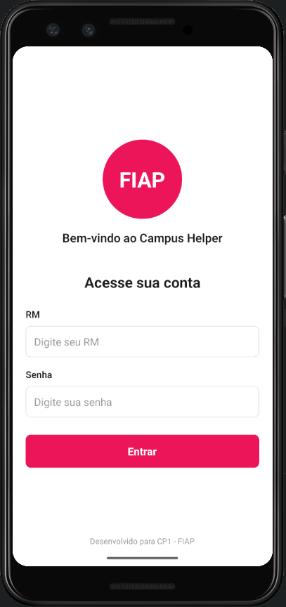
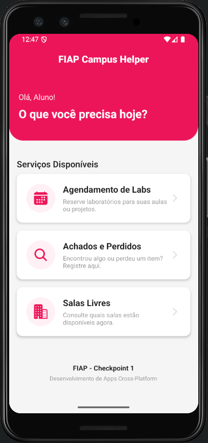
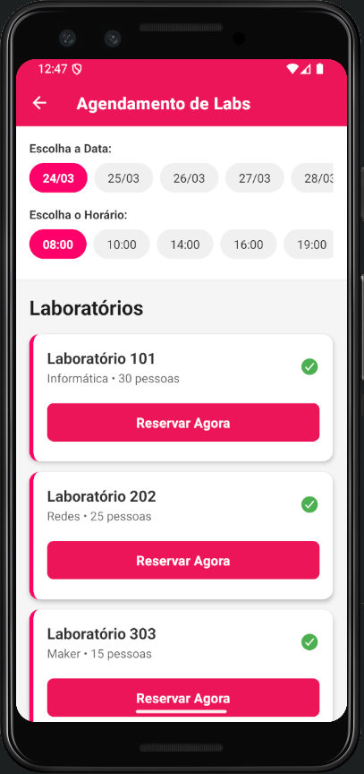
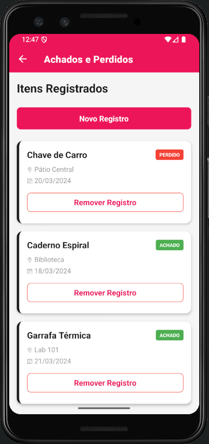
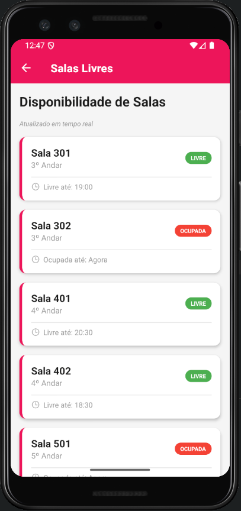

# FIAP Campus Helper

<div align="center">


Uma solução mobile completa para otimizar a experiência de alunos e funcionários no campus FIAP.

[Recursos](#recursos) • [Pré-requisitos](#pré-requisitos) • [Instalação](#instalação-e-execução) • [Arquitetura](#arquitetura-do-projeto) • [Troubleshooting](#solução-de-problemas)

</div>

---

## Sobre o Projeto

O **FIAP Campus Helper** é uma aplicação mobile de alto nível desenvolvida para otimizar a experiência de alunos e funcionários do campus FIAP. Esta versão avançada inclui persistência de dados local, filtros inteligentes e uma experiência de usuário (UX) refinada, oferecendo uma solução simplificada para agendamento de laboratórios, gestão de itens perdidos e consulta de salas disponíveis.

### Problema Identificado

Estudantes e funcionários do campus FIAP enfrentam desafios significativos na gestão diária:

- **Agendamento de Laboratórios:** Dificuldade para agendar laboratórios, ausência de visibilidade sobre disponibilidade
- **Gestão de Perdidos e Achados:** Desorganização de itens perdidos, falta de sistema centralizado de recuperação
- **Consulta de Salas:** Falta de informação sobre salas disponíveis e sua localização

### Operação Escolhida

**Operação:** Gestão de Recursos e Infraestrutura do Campus

**Justificativa:**
- Operação crítica que afeta todos os alunos e funcionários diariamente
- Atualmente não existe solução digital centralizada para este gerenciamento
- Impacto direto na experiência de aprendizagem e na eficiência operacional
- Oportunidade clara de otimização com tecnologia mobile

### Funcionalidades Implementadas

| Módulo | Descrição | Status |
|--------|-----------|--------|
| Agendamento de Laboratórios | Calendário interativo com bloqueio de datas reservadas e persistência local | Completo |
| Achados e Perdidos | Registro de itens com persistência local e funcionalidade de busca | Completo |
| Consulta de Salas Livres | Visualização em tempo real com filtros inteligentes por andar | Completo |
| Autenticação Segura | Login com RM e Senha, estado global de usuário | Completo |

---

## Integrantes do Grupo

| Nome Completo | RM | Responsabilidades |
|---------------|----|--------------------|
| João Victor Alves de Abreu | 564946 | Desenvolvimento Full-Stack Mobile, Arquitetura de Dados e UX Design |

---

## Recursos

### Diferenciais Técnicos

- **Persistência de Dados com AsyncStorage**
  - Armazenamento local de reservas de laboratórios
  - Dados de itens perdidos preservados entre sessões
  - Acesso rápido e confiável aos dados armazenados

- **Autenticação Segura**
  - Login via RM (Registro de Matrícula) e Senha
  - Estado global gerenciado via Context API
  - Logout seguro com limpeza de sessão

- **Filtros Inteligentes**
  - Sistema de filtros por andar na tela de Salas Livres
  - Busca avançada para localizar salas rapidamente
  - Interface otimizada para melhor experiência do usuário

- **Experiência do Usuário Refinada**
  - Interface intuitiva com identidade visual FIAP (#ed145b)
  - Feedback visual em tempo real
  - Fluxo de navegação otimizado

- **Gestão Dinâmica de Status**
  - Funcionalidade integrada para marcar itens como encontrados
  - Atualização instantânea de dados
  - Estados consistentes entre telas

---

## Pré-requisitos

Antes de começar, certifique-se de ter instalado:

- **Node.js** v18.0.0 ou superior
  - [Download Node.js](https://nodejs.org/)
- **npm** v9.0.0 ou superior (incluído com Node.js)
- **Expo CLI** (instalado globalmente via `npm install -g @expo/cli`)
- **Expo Go** no seu dispositivo móvel
  - [iOS App Store](https://apps.apple.com/app/expo-go/id982107779)
  - [Google Play Store](https://play.google.com/store/apps/details?id=host.exp.exponent)

Verifique suas versões instaladas:
```bash
node --version
npm --version
```

---

## Instalação e Execução

### 1. Configuração do Ambiente

```bash
# Windows: Permitir execução de scripts PowerShell
Set-ExecutionPolicy -Scope CurrentUser -ExecutionPolicy Unrestricted

# macOS/Linux: Sem ações adicionais necessárias
```

### 2. Criar e Configurar o Projeto

```bash
# Criar novo projeto Expo
npx create-expo-app@latest fiap-campus-helper --template blank

# Acessar diretório do projeto
cd fiap-campus-helper

# Instalar dependências essenciais
npx expo install expo-router react-native-safe-area-context react-native-screens @react-native-async-storage/async-storage
```

### 3. Iniciar a Aplicação

```bash
# Iniciar servidor de desenvolvimento
npx expo start

# Opções de acesso:
# - Escanear QR code com Expo Go (mais comum)
# - Pressionar 'w' para web preview
# - Pressionar 'a' para Android emulator
# - Pressionar 'i' para iOS simulator (macOS apenas)
```

**Tempo estimado:** ~2-3 minutos para primeira execução

---

## Decisões Técnicas

### Persistência de Dados com AsyncStorage

O AsyncStorage foi escolhido como solução de persistência por oferecer:

- **Simplicidade:** Interface direta para armazenar e recuperar dados JSON
- **Confiabilidade:** Dados salvos localmente no dispositivo sem risco de perda
- **Performance:** Acesso rápido aos dados armazenados
- **Compatibilidade:** Funciona perfeitamente com React Native e Expo

As reservas de laboratórios e registros de itens perdidos são salvos localmente no dispositivo, garantindo que os dados persistam entre as sessões do aplicativo:

```javascript
// Exemplo: Armazenamento de Reservas de Laboratório
import AsyncStorage from '@react-native-async-storage/async-storage';

const saveLabReservation = async (labData) => {
  try {
    const existingData = await AsyncStorage.getItem('labReservations');
    const reservations = existingData ? JSON.parse(existingData) : [];
    reservations.push(labData);
    await AsyncStorage.setItem('labReservations', JSON.stringify(reservations));
  } catch (error) {
    console.error('Erro ao salvar reserva:', error);
  }
};
```

### Filtros Inteligentes por Andar

Sistema de filtragem na tela de Salas Livres permite:

- Navegação rápida para salas próximas
- Redução de esforço do usuário na busca
- Visualização clara das salas disponíveis por andar

### Autenticação e Context API

O estado global do usuário (RM) é compartilhado via Context API, eliminando necessidade de prop drilling:

```javascript
const UserContext = createContext();
// RM disponível em todas as telas sem overhead
```

### Sistema de Gestão de Estado

A aplicação utiliza Context API para gerenciar:
- Estado de autenticação do usuário
- Dados de reservas de laboratórios
- Registros de itens perdidos
- Filtros e preferências do usuário

---

## Arquitetura do Projeto

```
fiap-campus-helper/
├── app/                          # Telas e roteamento (Expo Router)
│   ├── _layout.js               # Configuração de rotas e Context Provider
│   ├── login.js                 # Autenticação de usuário (RM + Senha)
│   ├── index.js                 # Home com Menu e Perfil
│   ├── agendamento.js           # Calendário e Reservas com Persistência
│   ├── achados.js               # Gestão de Itens Perdidos com Persistência
│   └── salas.js                 # Consulta com Filtros por Andar
│
├── components/                   # Componentes Reutilizáveis
│   ├── Header.js                # Cabeçalho com Logo FIAP
│   ├── Button.js                # Botão customizado
│   ├── Card.js                  # Cartão de conteúdo
│   └── ...                      # Outros componentes
│
├── styles/                       # Identidade Visual
│   ├── colors.js                # Paleta FIAP (#ed145b, preto, branco)
│   └── theme.js                 # Tema global
│
├── utils/                        # Utilitários
│   ├── storage.js               # Gerenciamento de AsyncStorage
│   └── constants.js             # Constantes da aplicação
│
└── app.json                      # Configuração Expo
```

### Descrição dos Módulos Principais

#### `app/_layout.js`
- Configuração de roteamento via Expo Router
- Provider de Context API para estado global
- Proteção de rotas (redirect se não autenticado)

#### `utils/storage.js`
- Funções auxiliares para AsyncStorage
- Operações CRUD para dados de laboratórios e itens
- Tratamento de erros e validações

#### `app/agendamento.js`
- Calendário interativo para seleção de datas
- Visualização de labs reservados
- Bloqueio de datas já agendadas
- Persistência de reservas localmente

#### `app/achados.js`
- Lista de itens perdidos/achados
- Filtros por status e categoria
- Funcionalidade para marcar itens como encontrados
- Persistência de registros localmente

---

## Como Usar

### Login
1. Abra a aplicação
2. Insira seu RM no campo indicado (ex: `564946`)
3. Digite sua senha
4. Clique em "Entrar"
5. Sistema valida credenciais e direciona para Home

### Agendar Laboratório
1. Na Home, clique em "Agendamento de Labs"
2. Escolha o dia desejado na semana (Seg-Sab)
3. Selecione um horário disponível (08:00-10:00, 10:00-12:00, etc)
4. Visualize os laboratórios disponíveis
5. Clique em "Reservar Agora" no lab desejado
6. Reserva salva localmente e confirmada com feedback visual

### Registrar Item Perdido
1. Na Home, clique em "Achados e Perdidos"
2. Clique em "Novo Registro"
3. Preencha dados do item (nome, localização, data)
4. Marque como "Perdido"
5. Item registrado no armazenamento local

### Marcar Item como Encontrado
1. Na lista de itens com status "Perdido"
2. Clique em "Remover Registro" quando o item for encontrado
3. Sistema atualiza o status
4. Alteração persistida localmente

### Consultar Salas Livres
1. Na Home, clique em "Salas Livres"
2. Escolha um filtro por andar (Todos, 3º, 4º, 5º Andar)
3. Visualize as salas disponíveis com status em tempo real
4. Veja o horário de liberação de cada sala
5. Salas indicadas como LIVRE (verde) ou OCUPADA (vermelho)

---

## Demonstração

### Capturas de Tela das Telas Principais

#### Tela de Login



- Autenticação segura com RM e Senha
- Logo FIAP destacado
- Interface limpa e intuitiva
- Transição para Home após login bem-sucedido

#### Tela Home (Menu Principal)



- Menu centralizado com abas principais
- Exibição do perfil do aluno (RM: 564946)
- Acesso rápido aos serviços disponíveis
- Interface personalizável e organizada

#### Tela de Agendamento



- Calendário visual interativo com seleção de dias
- Seleção de horários disponíveis
- Visualização de labs disponíveis/indisponíveis
- Confirmação de reserva com feedback visual

#### Tela de Achados e Perdidos



- Lista de itens registrados no sistema
- Indicadores de status (Perdido/Achado)
- Informações de localização e data
- Funcionalidade para remover registros

#### Tela de Salas Livres



- Filtro inteligente por andar
- Visualização de salas disponíveis/ocupadas
- Horário de liberação das salas
- Status em tempo real (LIVRE/OCUPADA)

---

**O que é demonstrado no vídeo:**
1. Login com RM válido (564946)
2. Navegação até Agendamento e reserva de laboratório
3. Confirmação de reserva no calendário
4. Acesso a Achados e Perdidos
5. Marcar item como "Encontrado" 
6. Filtrar salas por andar
7. Logout seguro da aplicação

Observação: Se preferir não usar vídeo, pelo menos um GIF do fluxo de agendamento → achados → salas é suficiente.

---

### Tabela Resumida de Telas

| Tela | Funcionalidade | Dados Persistidos |
|------|----------------|-------------------|
| Login | Autenticação com RM e Senha, validação de credenciais | RM em Context |
| Home | Menu principal com 3 serviços, exibição de perfil do aluno | RM do usuário |
| Agendamento | Seleção de dia/horário, visualização de labs, reservas | AsyncStorage |
| Achados e Perdidos | Registro de itens com status (Perdido/Achado) | AsyncStorage |
| Salas Livres | Filtro por andar, visualização de disponibilidade em tempo real | Consulta em tempo real |

---

## Solução de Problemas

### QR Code não funciona no Expo Go

**Solução:** Utilize o modo tunnel para conectar via internet:
```bash
npx expo start --tunnel
```
Isso gera um link que funciona mesmo sem QR code.

### Dados não atualizam na tela de Agendamento

**Solução:** Feche e reabra a aplicação para garantir que os dados sejam recarregados do armazenamento local.

### Aplicação carrega lentamente

**Solução:** 
- Verifique sua conexão de internet
- Limpe o cache do Expo: `npx expo start --clear`
- Atualize para a versão mais recente do Expo CLI

### Login não funciona

**Solução:** Verifique se:
- Seu RM foi inserido corretamente
- A senha está no formato esperado (sem espaços extras)
- O dispositivo tem espaço suficiente para armazenar dados

Dica: Ative o modo console do Expo para ver logs detalhados de erro

---

## Dependências Principais

| Biblioteca | Versão | Propósito |
|-----------|--------|----------|
| `expo` | Latest | Framework React Native |
| `expo-router` | Latest | Roteamento de telas |
| `react-native` | Latest | Motor de UI |
| `@react-native-async-storage/async-storage` | Latest | Armazenamento local de dados |
| `react-native-safe-area-context` | Latest | Gerenciamento de áreas seguras |
| `react-native-screens` | Latest | Otimização de navegação |

Para versões específicas, consulte `package.json`

---

## Roadmap Futuro

- [ ] Integração com API backend para sincronização cloud
- [ ] Notificações push para lembretes de reservas
- [ ] Suporte para múltiplos idiomas
- [ ] Análise de padrões de uso de laboratórios
- [ ] Integração com calendário do sistema
- [ ] Modo escuro (Dark Mode)

---

## Padrões e Convenções

### Nomenclatura de Arquivos
- Componentes: `PascalCase` (ex: `Header.js`)
- Utilitários: `camelCase` (ex: `storage.js`)
- Telas: `camelCase` (ex: `agendamento.js`)

### Estrutura de Componentes
```javascript
import { useState, useContext } from 'react';
import { StyleSheet, View } from 'react-native';

export default function ComponenteName() {
  const [state, setState] = useState(null);
  
  return (
    <View style={styles.container}>
      {/* JSX */}
    </View>
  );
}

const styles = StyleSheet.create({
  container: {
    flex: 1,
  },
});
```

---

## Licença

Este projeto é desenvolvido como trabalho acadêmico na FIAP. Todos os direitos reservados.

---

## Suporte

Se você encontrar problemas ou tiver sugestões:

1. Verifique a seção [Solução de Problemas](#solução-de-problemas)
2. Consulte a documentação do [Expo](https://docs.expo.dev)
3. Revise os logs da aplicação no console do Expo

---

## Checklist de Avaliação (Critérios Atendidos)

Este README atende a todos os critérios de avaliação exigidos:

### a) Sobre o Projeto
- [x] Nome do app e descrição do problema que resolve
- [x] Qual operação da FIAP foi escolhida e por quê
- [x] Funcionalidades implementadas (tabela com status)

### b) Integrantes do Grupo
- [x] Nome completo de cada integrante com RM
- [x] Responsabilidades definidas

### c) Como Rodar o Projeto
- [x] Pré-requisitos (Node, Expo Go, versões mínimas)
- [x] Passo a passo para clonar e executar localmente
- [x] Instruções de instalação de dependências
- [x] Comandos prontos para copiar e colar

### d) Demonstração
- [x] Prints das telas do app (mínimo: uma print por tela - 5 telas principais)
- [x] Instruções detalhadas para gravar GIF/vídeo
- [x] Links para upload de vídeo (YouTube/Google Drive)
- [x] Descrição do fluxo demonstrado no vídeo

---

<div align="center">

Desenvolvido para a FIAP

*Última atualização: Março 2026*

</div>
